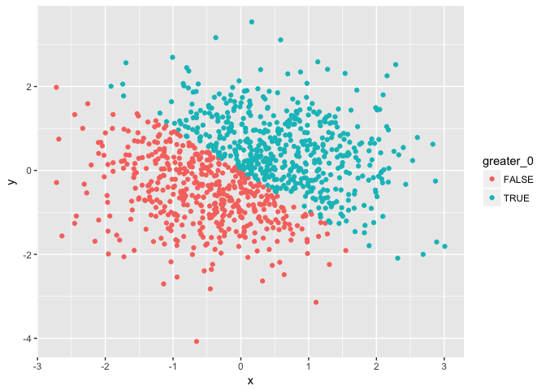
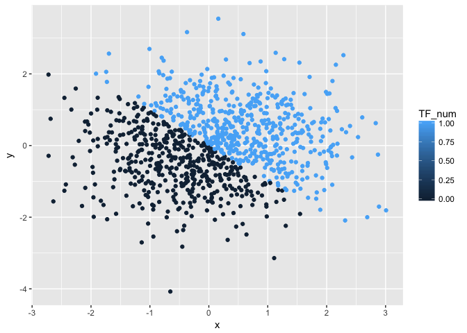
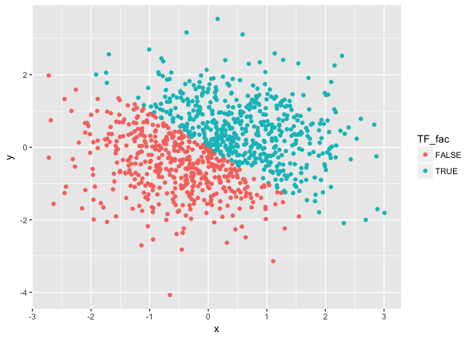

p8105\_hw1\_ms5533
================
Marisa Sobel
2018-09-21

# Problem 1

``` r
set.seed(1)
prob1_df = tibble(
  list = runif(10, min = 0, max = 5), 
  greater_2 = list > 2, 
  vec_car = c("Will", "I", "ever", "be", "able", "to", "remember", "any", "R", "commands"), 
  vec_fac = c("yes", "no", "yes", "no", "yes", "no", "yes", "no", "yes", "no")
)
```

### Mean of each variable in dataframe

``` r
mean(prob1_df$list)
```

    ## [1] 2.757569

``` r
mean(prob1_df$greater_2)
```

    ## [1] 0.6

``` r
mean(prob1_df$vec_car)
```

    ## Warning in mean.default(prob1_df$vec_car): argument is not numeric or
    ## logical: returning NA

    ## [1] NA

``` r
mean(prob1_df$vec_fac)
```

    ## Warning in mean.default(prob1_df$vec_fac): argument is not numeric or
    ## logical: returning NA

    ## [1] NA

The mean of `list` and the logical vector `greater_2` are possible.
`list` is a list of numbers, and therefore a mean is possible and equals
**2.76**. `greater_2` is a logical vector with a dichotomized outcome
(‘TRUE’/‘FALSE’), coded as ‘1’ or ‘0’, and equals **0.6**. Means of
`vec_car` and `vec_factor` cannot compute as they are not numeric.

### As numeric variables

``` r
as.numeric(prob1_df$greater_2)
as.numeric(prob1_df$vec_car)
as.numeric(prob1_df$vec_fac)
```

When applying the `as.numeric` function to the logical vector, it
produced the same result, it changed ‘FALSE’ to ‘0’ and ‘TRUE’ to ‘1’.
The `as.numeric` function did not change the outcome of the character or
factor vectors. Though I expected it to change the factor into numerical
associations with ‘yes’ and ‘no’ since there were no other options.

### Changing classes of variables

``` r
as.numeric(as.factor(prob1_df$vec_car))
as.numeric(as.character(prob1_df$vec_fac))
```

Converting the character vector to factor and then to numeric is
possible; it returns a numeric list. If first orders the words
alphabetically, then it applies numbers to the alphabetical list. The
output then is the corresponting number to the word in the original
order.

Converting the factor vector to character to numeric, however, is not
possible here.

# Problem 2

``` r
set.seed(2)
prob2_df = tibble(
  x = rnorm(1000),
  y = rnorm(1000),
  greater_0 = x + y > 0, 
  TF_num = as.numeric(greater_0),
  TF_fac = as.factor(greater_0)
)
```

The data frame created has a size of 5000 data points, with 1000
observations and 5 variables. The mean of `x` is equal to **0.062** and
the median of `x` is equal to **0.05014**. **530** data points of
**1000** total are above 0 (530/1000).

### Scatterplot of *y* vs *x* by logical variable

<!-- -->

There is a clear distribution of values of `x+y > 0` and `x+y < 0` along
the line `y = -x`.

### Scatterplot of *y* vs *x* by numeric variable

<!-- -->

The same distribution is seen as above between points with values of
`x+y > 0` and `x+y < 0` along the line `y = -x`. However, as they are
now color-coded by a numeric variable and not a categorical variable,
the legend shows a ramp of colors possible based on the value. Since it
is a dichotomous variable, there are only two options, ‘1’ and ‘0’.
Therefore the chart looks the same.

### Scatterplot of *y* vs *x* by factor variable

<!-- -->

The same distribution is seen as in the first plot, as ‘TRUE’ is coded
as ‘1’ and ‘FALSE’ is coded as ‘0’.

### Save `plot1` into wd
